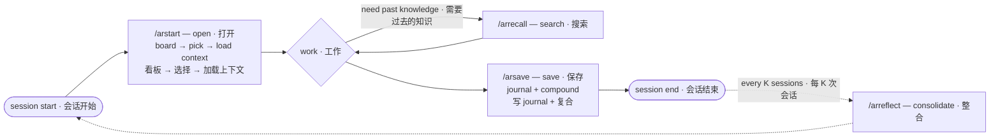

> Full reference README. The short landing version is [README.md](README.md).

<h1 align="center">AgentRecall</h1>

<p align="center"><strong>Your agent doesn't just remember. It learns how you think.</strong></p>
<p align="center"><strong>你的 agent 不只是记得。它在学你怎么想。</strong></p>
<p align="center">Every correction saved is a mistake never repeated. Every insight compounded is tokens never wasted rebuilding context.<br/>每一次纠正都是不会重复的错误。每一次复合都是不会重建的上下文。</p>
<p align="center">Persistent, compounding memory + automatic correction capture. MCP · SDK · CLI · Skill.</p>

<p align="center">
  <a href="https://t.me/+ywZwoHrg3AM0NDVi"></a>
  <a href="https://www.npmjs.com/package/agent-recall-mcp"></a>
  <a href="https://www.npmjs.com/package/agent-recall-sdk"></a>
  <a href="https://www.npmjs.com/package/agent-recall-cli"></a>
  <a href="https://github.com/Goldentrii/AgentRecall-X/blob/main/LICENSE"></a>
  <a href="https://lobehub.com/mcp/goldentrii-agentrecall"></a>
  
  
  
  
  
  
  
</p>

<p align="center">
  <b>EN:</b>&nbsp;
  <a href="#what-why--什么和为什么">Why</a> ·
  <a href="#5-memory-layers--五层记忆模型">Memory</a> ·
  <a href="#quick-start--快速开始">Install</a> ·
  <a href="#mcp-tools">Tools</a> ·
  <a href="#how-memory-compounds--记忆如何复合">Compounding</a> ·
  <a href="#whats-new-in-phase-6--phase-6-新增">Phase 6</a> ·
  <a href="#sdk-api">SDK</a> ·
  <a href="#cli">CLI</a> ·
  <a href="#architecture--架构">Arch</a>
  &nbsp;&nbsp;|&nbsp;&nbsp;
  <b>中文:</b>&nbsp;
  <a href="#what-why--什么和为什么">什么</a> ·
  <a href="#5-memory-layers--五层记忆模型">记忆模型</a> ·
  <a href="#quick-start--快速开始">安装</a> ·
  <a href="#mcp-tools">工具</a> ·
  <a href="#how-memory-compounds--记忆如何复合">复合</a> ·
  <a href="#whats-new-in-phase-6--phase-6-新增">新增</a>
</p>

---

<p align="center">
  <a href="#the-session-loop--会话循环"></a>
  <a href="#the-session-loop--会话循环"></a>
  <a href="#the-session-loop--会话循环"></a>
  <a href="#the-session-loop--会话循环"></a>
</p>

---

## What & Why · 什么和为什么

<table>
<tr>
<th width="50%">🇬🇧 English</th>
<th width="50%">🇨🇳 中文</th>
</tr>
<tr>
<td>

**AgentRecall is not a memory tool. It's a learning loop.**

Memory is the mechanism. Understanding is the goal. Every time you correct your agent — *"no, not that version"*, *"put this section first"*, *"ask me before you assume"* — that correction is stored, weighted, and recalled next time.

After 10 sessions, your agent doesn't just remember your project. It understands how you think: your priorities, your communication style, your non-negotiables.

</td>
<td>

**AgentRecall 不是记忆工具，是学习闭环。**

记忆是机制，理解才是目标。每一次纠正——*"不是那个版本"*、*"先放这一段"*、*"假设之前先问我"*——都会被存储、加权、并在下次召回。

跑 10 次会话之后，agent 不只是记得项目，它理解你的思考方式：优先级、沟通风格、不可妥协的底线。

</td>
</tr>
<tr>
<td>

**Five things that make it different:**

- **Correction-first.** When you say "no, that's wrong", we log a `CorrectionRecord` with severity, holder, and evidence. After N confirmations across sessions, it auto-promotes to a cross-project insight.
- **Measurable learning loop.** Every correction tracks `retrieved_count`, `heeded_count`, `recurrence_count`, `precision`. The KPI that matters: *did the same bug recur after we warned about it?*
- **Five memory types.** Episodic, semantic, procedural, narrative, correction — mapped to canonical cognitive-psychology taxonomy (Squire 2004, Tulving 1972).
- **Local markdown only.** Everything lives in `~/.agent-recall/`. Open it in Obsidian. Grep it in the terminal. Version it in git. No cloud, no API keys, no lock-in.
- **Backed by published math.** FSRS-lite decay (Ebbinghaus → SuperMemo → FSRS-6), Modern Hopfield retrieval (Ramsauer 2020), RRF fusion (Cormack 2009).

</td>
<td>

**让它不同的五件事：**

- **以纠正为先。** 你说"不对"时，我们记下 `CorrectionRecord`（严重度、归属、证据）。跨会话被确认 N 次后，自动晋升为跨项目的 insight。
- **可量化的学习闭环。** 每条纠正都跟踪 `retrieved_count`（被召回多少次）、`heeded_count`（被遵守多少次）、`recurrence_count`（同样的 bug 是否复发）、`precision`。唯一重要的 KPI：警告之后同样的 bug 还复发吗？
- **五种记忆类型。** Episodic、semantic、procedural、narrative、correction —— 对应认知心理学经典分类（Squire 2004、Tulving 1972）。
- **只用本地 markdown。** 一切都在 `~/.agent-recall/`。用 Obsidian 打开、用终端 grep、用 git 版本管理。零云、零 API key、零锁定。
- **基于已发表数学。** FSRS-lite 衰减（Ebbinghaus → SuperMemo → FSRS-6）、Modern Hopfield 检索（Ramsauer 2020）、RRF 融合（Cormack 2009）。

</td>
</tr>
</table>

---

## 5 Memory Layers · 五层记忆模型

The canonical cognitive-psychology taxonomy mapped to your agent's filesystem · 把认知心理学的经典记忆分类映射到你的文件系统：

<table>
<tr>
<th>Layer · 层</th>
<th>Type · 类型</th>
<th>EN — What it holds</th>
<th>中文 — 存什么</th>
<th>Path</th>
</tr>
<tr>
<td>1</td>
<td><b>Episodic</b><br/>情景</td>
<td>What happened in each session, chronologically. Auto-written by the agent during work.</td>
<td>每次会话发生了什么，按时间顺序。Agent 工作时自动写入。</td>
<td><code>journal/</code></td>
</tr>
<tr>
<td>2</td>
<td><b>Semantic</b><br/>语义</td>
<td>Topic-clustered facts with <code>[[wikilinks]]</code>: Architecture, Goals, Blockers, etc.</td>
<td>按主题聚类的事实，带 <code>[[wikilinks]]</code>：架构、目标、阻塞等。</td>
<td><code>palace/rooms/</code></td>
</tr>
<tr>
<td>3</td>
<td><b>Procedural</b><br/>程序<br/><i>NEW</i></td>
<td>IF-THEN production rules: <i>"When setting up Cloudflare DNS, do these 4 steps."</i> Reusable how-tos.</td>
<td>IF-THEN 产生式规则："设置 Cloudflare DNS 时，按这 4 步走"。可复用的操作流程。</td>
<td><code>palace/skills/</code></td>
</tr>
<tr>
<td>4</td>
<td><b>Narrative</b><br/>叙事</td>
<td>Project phase milestones: Goal → What was hard → How solved → Synthesis (1-sentence reusable lesson).</td>
<td>项目阶段里程碑：目标 → 难点 → 怎么解决的 → 提炼（一句话可复用的经验）。</td>
<td><code>palace/pipeline/</code></td>
</tr>
<tr>
<td>5</td>
<td><b>Correction</b><br/>纠正</td>
<td>Behavioral calibration: rules the agent must follow, with precision KPIs tracking effectiveness.</td>
<td>行为校准：agent 必须遵守的规则，配合 precision KPI 追踪有效性。</td>
<td><code>corrections/</code></td>
</tr>
<tr>
<td>+</td>
<td><b>Awareness</b><br/>感知</td>
<td>Cross-project insights promoted from N-confirmed corrections. The compounding layer.</td>
<td>跨项目的 insight，由确认 N 次以上的纠正晋升而来。复合层。</td>
<td><code>palace/awareness</code></td>
</tr>
</table>

All five layers share one **canonical naming grammar** (`<scope>/<type>/[<topic>/]<temporal>--<slug>.md`) so any agent — Claude, Codex, future LLM — can compose retrieval paths from intent instead of grepping five conventions. Existing files keep working via a `legacy_path` virtual-key view. No migration needed.

所有五层共享一个 **规范命名语法**（`<scope>/<type>/[<topic>/]<temporal>--<slug>.md`），任何 agent —— Claude、Codex、未来的 LLM —— 都能用意图组合检索路径，不用 grep 五套命名约定。旧文件通过 `legacy_path` 虚拟键视图继续可用。无需迁移。

---

## The Session Loop · 会话循环



<table>
<tr>
<th>Command</th>
<th>When · 什么时候</th>
<th>EN — What it does</th>
<th>中文 — 做什么</th>
</tr>
<tr>
<td>🔴 <code>/arstart</code></td>
<td><b>First — every session</b><br/>每个会话最先</td>
<td>OPEN. No args = status board across ALL projects (pending work, blockers) → pick by number → load that project's deep context (palace rooms, corrections, task recall). <code>/arstart &lt;slug&gt;</code> loads directly; <code>/arstart bootstrap</code> scans your machine and imports existing projects.</td>
<td>OPEN（打开）。不带参数 = 所有项目的状态看板（待办、阻塞）→ 按编号选 → 加载该项目的深度上下文（palace 房间、纠正记录、任务相关召回）。<code>/arstart &lt;slug&gt;</code> 直接加载；<code>/arstart bootstrap</code> 扫描你的机器并导入已有项目。</td>
</tr>
<tr>
<td>🔴 <code>/arsave</code></td>
<td><b>Last — every session</b><br/>每个会话最后</td>
<td>SAVE. Write journal + palace consolidation + awareness compounding. <code>/arsave all</code> batch-saves every parallel session of the day (scan, merge, deduplicate).</td>
<td>SAVE（保存）。写 journal + palace 合并 + awareness 复合。<code>/arsave all</code> 批量保存当天所有并行会话（扫描、合并、去重）。</td>
</tr>
<tr>
<td><code>/arrecall</code></td>
<td>Mid-session, on demand<br/>会话中，按需</td>
<td>SEARCH. Surface past knowledge for the current task — documented fixes, prior decisions, patterns.</td>
<td>SEARCH（搜索）。为当前任务浮现过去的知识——已记录的修复方案、历史决策、模式。</td>
</tr>
<tr>
<td><code>/arreflect</code></td>
<td>Every K sessions<br/>每 K 次会话</td>
<td>CONSOLIDATE. Periodic triage: confirm recurrence/phantom matches, cluster new error classes, propose rule re-abstractions (rule edits stay owner-gated).</td>
<td>CONSOLIDATE（整合）。周期性 triage：确认复发/幻影匹配，聚类新的错误类别，提出规则再抽象建议（规则修改仍由 owner 把关）。</td>
</tr>
</table>

> **Without `/arstart`, a fresh agent has zero orientation. Without `/arsave`, nothing compounds. Those two are the spine; `/arrecall` and `/arreflect` compound it.**
> 没有 `/arstart`，新 agent 完全失去方向。没有 `/arsave`，什么都不会复合。这两个是主干；`/arrecall` 和 `/arreflect` 让它持续复合。

---

## Already Using Another Memory System? · 已经用过别的？

**`/arstart bootstrap`** scans your machine and imports everything: git repos, Claude AutoMemory (`~/.claude/projects/`), CLAUDE.md files. Read-only scan, secrets never touched.

**`/arstart bootstrap`** 扫描你的机器并导入所有：git 仓库、Claude AutoMemory（`~/.claude/projects/`）、CLAUDE.md 文件。只读扫描，secrets 永不触碰。

```bash
ar bootstrap            # scan and show what was found
ar bootstrap --import   # import all new projects
```

---

## Quick Start · 快速开始

### MCP Server — for AI agents

```bash
# Claude Code
claude mcp add --scope user agent-recall -- npx -y agent-recall-mcp

# Cursor — .cursor/mcp.json
{ "mcpServers": { "agent-recall": { "command": "npx", "args": ["-y", "agent-recall-mcp"] } } }

# VS Code — .vscode/mcp.json
{ "servers": { "agent-recall": { "command": "npx", "args": ["-y", "agent-recall-mcp"] } } }

# Windsurf — ~/.codeium/windsurf/mcp_config.json
{ "mcpServers": { "agent-recall": { "command": "npx", "args": ["-y", "agent-recall-mcp"] } } }

# Codex
codex mcp add agent-recall -- npx -y agent-recall-mcp
```

**Skill (Claude Code only) · 仅 Claude Code：**

```bash
mkdir -p ~/.claude/skills/agent-recall
curl -o ~/.claude/skills/agent-recall/SKILL.md \
  https://raw.githubusercontent.com/Goldentrii/AgentRecall-X/main/SKILL.md
```

### SDK — for JS/TS applications

```bash
npm install agent-recall-sdk
```

```typescript
import { AgentRecall } from "agent-recall-sdk";
const memory = new AgentRecall({ project: "my-app" });
await memory.capture("What stack?", "Next.js + Postgres");
const ctx = await memory.recall("rate limiting");
```

### CLI — for terminal & CI

```bash
npx agent-recall-cli capture "What stack?" "Next.js + Postgres"
npx agent-recall-cli recall "rate limiting"
npx agent-recall-cli palace walk --depth active
```

---

## MCP Tools

<table>
<tr>
<th>Category · 类别</th>
<th>Tool</th>
<th>EN — What it does</th>
<th>中文 — 做什么</th>
</tr>
<tr><td rowspan="5"><b>Default (5)</b><br/>默认（5 个）<br/><i>Two verbs + three essentials</i></td>
    <td><code>session_start</code></td><td>Inhale — load context at session start (corrections, insights, watch_for warnings).</td><td>吸入——会话开始时加载上下文（纠正记录、insights、预测警告）。</td></tr>
<tr><td><code>session_end</code></td><td>Exhale — save journal + insights + trajectory; compounds memory over time.</td><td>呼出——保存 journal + insights + trajectory；随时间复合记忆。</td></tr>
<tr><td><code>remember</code></td><td>Write a memory, auto-routes to the right palace room.</td><td>写入一条记忆，自动路由到合适的 palace 房间。</td></tr>
<tr><td><code>recall</code></td><td>Search all memory (local keyword/substring matching + RRF fusion, plus optional vector + Hopfield rerank).</td><td>搜索所有记忆（本地关键词/子串匹配 + RRF 融合，再加上可选的向量 + Hopfield 重排）。</td></tr>
<tr><td><code>check</code></td><td>Record agent understanding; the system anticipates the likely correction before you make it.</td><td>记录 agent 的理解；在你纠正之前预测最可能的纠正。</td></tr>
<tr><td colspan="4" style="text-align:center;padding:6px 0"><b>— Full mode (<code>npx agent-recall-mcp --full</code>) —</b>&nbsp;&nbsp;|&nbsp;&nbsp;<b>— 完整模式 —</b></td></tr>
<tr><td rowspan="1"><b>Safety</b><br/>安全</td>
    <td><code>check_action</code></td><td>Pre-action matcher — warns before publish/push/deploy/DROP TABLE.</td><td>操作前匹配器——publish/push/deploy 前给出警告。</td></tr>
<tr><td colspan="4" style="text-align:center;padding:6px 0"><b>— Quarantined extras (<code>AR_EXTRAS=1 npx agent-recall-mcp --full</code>) —</b>&nbsp;&nbsp;|&nbsp;&nbsp;<b>— 隔离区扩展工具 —</b></td></tr>
<tr><td rowspan="5"><b>Pipeline</b><br/>叙事</td>
    <td><code>pipeline_open</code></td><td>Open a new project phase (Goal/Hard/Solved/Synthesis).</td><td>开启新的项目阶段（目标/难点/解决/提炼）。</td></tr>
<tr><td><code>pipeline_close</code></td><td>Close active phase with reflection fields. Status: closed / abandoned / pivoted.</td><td>关闭当前阶段并填反思字段。状态：closed / abandoned / pivoted。</td></tr>
<tr><td><code>pipeline_list</code></td><td>List all phases as JSON summaries.</td><td>列出所有阶段（JSON 摘要）。</td></tr>
<tr><td><code>pipeline_current</code></td><td>Return full content of the currently active phase.</td><td>返回当前 active 阶段的完整内容。</td></tr>
<tr><td><code>pipeline_show</code></td><td>Render a project's narrative spine — human-readable view of all phases.</td><td>渲染项目的叙事主干——所有阶段的人类可读视图。</td></tr>
<tr><td rowspan="2"><b>Behavior policy + cache</b><br/>行为策略 + 缓存</td>
    <td><code>register_rule</code></td><td>Save an IF-THEN behavior policy (always-loaded rules channel).</td><td>保存一条 IF-THEN 行为策略（常驻加载规则通道）。</td></tr>
<tr><td><code>digest</code></td><td>Context cache — store/recall/read/invalidate pre-computed analysis.</td><td>上下文缓存——存储/召回/读取/失效预计算分析。</td></tr>
</table>

> **Why only 5 by default?** The Automaticity Law (measured on the live corpus, 2026-06-12): push channels — `session_start`, `session_end`, correction hooks — show repeated behavior-changing usage. Pull channels had zero organic calls in 44 projects over weeks of real use, including from the agent that built them. Every extra tool in the default surface burns tool-definition tokens every session for zero behavioral return. The two-verb model (inhale/exhale) carries all compounding value; everything else is opt-in via `--full`, and the lowest-use tools (pipeline, register_rule, digest) are further gated behind `AR_EXTRAS=1`.
>
> **为什么默认只有 5 个工具？** 自动化定律（基于真实语料库测量，2026-06-12）：推送通道（`session_start`、`session_end`、纠正 hooks）有持续的行为改变使用记录；拉取通道在 44 个项目、数周真实使用中有零次有机调用——包括构建它们的 agent 本身。默认工具面每多一个工具就会在每次会话燃烧 tool-definition tokens，但零行为回报。双动词模型（吸入/呼出）承载了所有复合价值；其余功能通过 `--full` 按需开启，使用率最低的工具（pipeline、register_rule、digest）进一步隔离在 `AR_EXTRAS=1` 之后。
>
> **P3b purity census (2026-07-05):** `memory_query`, `skill_write`/`skill_recall`/`skill_list`, `dashboard_export`, `session_end_reflect`, `project_board`, `project_status`, and `bootstrap_scan`/`bootstrap_import` were removed from the MCP tool surface entirely (zero organic MCP calls). Their underlying logic is not deleted — narrative/skill functionality remains reachable via the SDK (see SDK API below), and status/consolidate/bootstrap remain reachable via the CLI (`ar status`, `ar consolidate`, `ar bootstrap`).
>
> **P3b 纯净普查（2026-07-05）：** `memory_query`、`skill_write`/`skill_recall`/`skill_list`、`dashboard_export`、`session_end_reflect`、`project_board`、`project_status`、`bootstrap_scan`/`bootstrap_import` 已从 MCP 工具面完全移除（MCP 调用记录为零）。底层逻辑并未删除——叙事/skill 功能仍可通过 SDK 访问（见下文 SDK API），状态/consolidate/bootstrap 仍可通过 CLI 访问（`ar status`、`ar consolidate`、`ar bootstrap`）。

---

## How Memory Compounds · 记忆如何复合

<table>
<tr>
<th>Mechanism · 机制</th>
<th>EN</th>
<th>中文</th>
</tr>
<tr>
<td><b>Auto-naming</b></td>
<td>Files name themselves from content via canonical grammar — agents compose paths from intent, no guessing.</td>
<td>文件根据内容用规范语法自命名——agent 按意图组合路径，不用猜。</td>
</tr>
<tr>
<td><b>FSRS-lite decay</b></td>
<td><code>R = exp(-days_since_lastConfirmed / S)</code>. Each recall hit reinforces stability. Cold facts get tagged <code>archive_candidate</code> instead of silently growing forever.</td>
<td><code>R = exp(-距上次确认天数 / S)</code>。每次召回命中会强化稳定性。冷的事实会被标 <code>archive_candidate</code>，而不是静默无限增长。</td>
</tr>
<tr>
<td><b>RRF + Hopfield retrieval</b></td>
<td>Local keyword/substring matching merged with optional vector search via RRF (Cormack 2009), then optionally re-ranked by Modern Hopfield (Ramsauer 2020) for associative blend.</td>
<td>本地关键词/子串匹配与可选的向量检索通过 RRF 融合（Cormack 2009），再可选地用 Modern Hopfield 重排（Ramsauer 2020）做关联融合。</td>
</tr>
<tr>
<td><b>Correction precision KPI</b></td>
<td>Every correction tracks <code>precision = heeded / retrieved</code>. <0.3 → archive candidate (noise). ≥0.8 → promote faster.</td>
<td>每条纠正跟踪 <code>precision = 被遵守 / 被召回</code>。<0.3 → archive 候选（噪声）。≥0.8 → 加速晋升。</td>
</tr>
<tr>
<td><b>Cross-project insights</b></td>
<td>Lessons learned in one project surface when you're working on a similar problem in another. Match by keyword + topic.</td>
<td>一个项目学到的经验，在另一个相似问题上会自动浮现。按关键词 + 主题匹配。</td>
</tr>
<tr>
<td><b>Awareness cap</b></td>
<td>Capped at 200 lines. New insights merge with existing (strengthening) or replace the weakest. After 100 sessions: still 200 lines, but cross-validated.</td>
<td>上限 200 行。新 insight 与已有合并（加强）或替换最弱的。100 次会话之后：仍然 200 行，但都是经过交叉验证的。</td>
</tr>
</table>

---

## What's New in Phase 6 · Phase 6 新增

Phase 6 closes 11 structural gaps the field's research literature flagged. Three improvement loops in one pass — 10-vantage research review → implementation → independent code review → fix-up.

Phase 6 修复了研究文献指出的 11 个结构性缺口。一次完成三个改进循环——10 视角研究审查 → 实现 → 独立代码审查 → 修复。

<table>
<tr>
<th>Change · 改动</th>
<th>Research grounding · 研究依据</th>
</tr>
<tr>
<td><b>Pipeline layer</b> — project narrative spine with 5 MCP tools<br/><b>叙事层</b> — 项目叙事主干 + 5 个 MCP 工具</td>
<td>Park et al. 2023 (Generative Agents) reflection pattern</td>
</tr>
<tr>
<td><b>Canonical naming system</b> — virtual key + <code>legacy_path</code>, no migration needed<br/><b>规范命名系统</b> — 虚拟键 + <code>legacy_path</code>，无需迁移</td>
<td>Squire 2004 taxonomy + CoALA architecture</td>
</tr>
<tr>
<td><b>Procedural memory (5th layer)</b> — <code>palace/skills/</code> + 3 MCP tools<br/><b>程序记忆（第 5 层）</b> — <code>palace/skills/</code> + 3 个 MCP 工具</td>
<td>Squire 2004 declarative/non-declarative split, ACT-R production rules</td>
</tr>
<tr>
<td><b>Correction outcome KPIs</b> — precision / heeded / recurrence tracking<br/><b>纠正结果 KPI</b> — precision / heeded / recurrence 追踪</td>
<td>Reflexion (Shinn 2023), RLAIF — making the learning loop measurable</td>
</tr>
<tr>
<td><b>FSRS-lite decay scorer</b> — reinforce on recall, decay on staleness<br/><b>FSRS-lite 衰减打分</b> — 召回时强化，过期时衰减</td>
<td>Ebbinghaus 1885 → SuperMemo → FSRS-6 (Anki ≥23.10)</td>
</tr>
<tr>
<td><b>Modern Hopfield re-ranker</b> — <code>ξ_new = X·softmax(β·X^⊤·ξ)</code><br/><b>Modern Hopfield 重排</b> — <code>ξ_new = X·softmax(β·X^⊤·ξ)</code></td>
<td>Ramsauer et al. 2020, exp(d/2) capacity vs classical 0.14·d</td>
</tr>
<tr>
<td><b>session_start lite mode</b> — ≤500 tokens, pull-on-demand<br/><b>session_start lite 模式</b> — ≤500 tokens，按需召回</td>
<td>Anthropic 2026 context engineering — "smallest high-signal set"</td>
</tr>
<tr>
<td><b>Agent-readable dashboard.json</b> — schema_version=1, one-call self-inspection<br/><b>Agent 可读的 dashboard.json</b> — schema_version=1，一次调用自查</td>
<td>Agent-first principle — humans aren't the only readers</td>
</tr>
<tr>
<td><b>Reflection bundle</b> — Park-style aggregation prompt (LLM call happens in the agent's turn, not core)<br/><b>反思包</b> — Park 风格的聚合 prompt（LLM 调用在 agent 自己的 turn 里，不在 core）</td>
<td>Park 2023 §4.3</td>
</tr>
<tr>
<td><b>Security hardening</b> — path traversal blocked, frontmatter YAML escaped, atomic writes, line-walk section parser<br/><b>安全加固</b> — 路径穿越封堵、frontmatter YAML 转义、原子写入、按行解析章节</td>
<td>8-agent red-team P0 findings (2026-05-30)</td>
</tr>
</table>

Full details: see [`UPDATE-LOG.md`](./UPDATE-LOG.md) Phase 6 section. Visual report: [`REPORT-2026-05-30.html`](./REPORT-2026-05-30.html).

完整细节见 [`UPDATE-LOG.md`](./UPDATE-LOG.md) Phase 6 章节。可视化报告：[`REPORT-2026-05-30.html`](./REPORT-2026-05-30.html)。

---

## SDK API

```typescript
import { AgentRecall } from "agent-recall-sdk";

const memory = new AgentRecall({ project: "my-app" });

// Write — auto-routes to journal / palace / awareness based on content
await memory.capture("What stack?", "Next.js + Postgres + Drizzle ORM");
await memory.remember("Database: pgvector enabled, RRF fusion for hybrid recall");

// Read — full hybrid search
const results = await memory.recall("rate limiting");
const filescoped = await memory.recall("auth flow", { file_path: "src/auth.ts" });

// Reflect — bundle recent journals + corrections for LLM-side distillation
const bundle = await memory.reflect({ lookback_days: 7 });

// Pipeline — track project narrative
await memory.pipelineOpen({ phase_name: "Discovery", goal: "Map user pain points" });
await memory.pipelineClose({
  what_was_hard: "Conflicting signals from interviews",
  how_solved: "Triangulated against analytics data",
  synthesis: "Behavior > stated preference when they diverge"
});

// Skills — save and recall procedural know-how
await memory.skillWrite({
  name: "Cloudflare 4-step routing",
  topic: "deploy",
  triggers: ["cloudflare", "dns", "ssl"],
  when: "Setting up a new domain with API gateway behind Cloudflare",
  steps: ["Add DNS record", "Enable Proxy", "Add Origin Rule", "Set SSL mode = Full"]
});
const hits = await memory.skillRecall({ intent: "set up cloudflare for new domain" });
```

---

## CLI

```bash
# Capture & recall
ar capture "Question" "Answer"
ar recall "topic"                # hybrid keyword + vector + Hopfield re-rank
ar recall "topic" --limit 5      # cap to top-5 hits

# Sessions
ar status                        # status board across all projects
ar saveall                       # batch save all parallel sessions

# Bootstrap
ar bootstrap                     # scan and show
ar bootstrap --import            # import all new projects

# Palace navigation
ar palace walk --depth active    # browse active rooms
ar palace read goals             # read a room
```

Run `ar --help` for the full surface · 完整命令运行 `ar --help`.

---

## Architecture · 架构

TypeScript monorepo, 4 published packages · TypeScript monorepo，4 个发布包：

```
packages/
├── core/          # storage + tool logic + helpers (agent-recall-core)
├── mcp-server/    # thin MCP wrappers (agent-recall-mcp)
├── sdk/           # programmatic API for JS/TS apps (agent-recall-sdk)
└── cli/           # `ar` shell command (agent-recall-cli)
```

**Storage layout · 存储布局:**

```
~/.agent-recall/
├── projects/
│   └── <slug>/
│       ├── journal/                  # episodic — per-session entries
│       ├── corrections/              # behavioral rules + outcome KPIs
│       └── palace/
│           ├── rooms/                # semantic — topic-clustered facts
│           ├── skills/               # procedural — IF-THEN rules (NEW)
│           ├── pipeline/             # narrative — project phases (NEW)
│           ├── identity.md
│           └── awareness             # cross-project insights
├── dashboard.html                    # human-readable dashboard
└── dashboard.json                    # agent-readable snapshot (NEW)
```

**Optional Supabase mirror · 可选 Supabase 镜像** — pgvector for semantic recall, RRF fusion when configured. All-local stays the default.

---

## Platform Compatibility · 平台兼容

| Platform | Mechanism | Status |
|---|---|---|
| Claude Code | MCP server + skill + hooks | ✅ Primary |
| Cursor | MCP server | ✅ |
| Windsurf | MCP server | ✅ |
| VS Code (Copilot) | MCP server | ✅ |
| Codex | MCP server | ✅ |
| Any JS/TS app | SDK (`agent-recall-sdk`) | ✅ |
| Terminal / CI | CLI (`ar`) | ✅ |

---

## Docs · 文档

- [`UPDATE-LOG.md`](./UPDATE-LOG.md) — phase-by-phase evolution + design reasoning
- [`REPORT-2026-05-30.html`](./REPORT-2026-05-30.html) — Phase 6 visual report
- [`docs/`](./docs) — command reference, architecture deep-dives
- [`SKILL.md`](./SKILL.md) — Claude Code skill definition

---

## Community · 社区

- 💬 [Telegram](https://t.me/+ywZwoHrg3AM0NDVi) — questions, feedback, requests
- 🐛 [GitHub Issues](https://github.com/Goldentrii/AgentRecall-X/issues) — bugs and feature requests
- 📦 [npm: agent-recall-mcp](https://www.npmjs.com/package/agent-recall-mcp)
- 📦 [npm: agent-recall-sdk](https://www.npmjs.com/package/agent-recall-sdk)
- 📦 [npm: agent-recall-cli](https://www.npmjs.com/package/agent-recall-cli)

---

## Contributing · 贡献

PRs welcome. Open an issue first for anything substantive — the design is opinionated and based on published research; we want changes to be grounded the same way.

欢迎 PR。任何实质性改动请先开 issue——这个设计有自己的主张，且基于已发表的研究；我们希望改动也能用同样的方式落地。

---

## License

MIT — see [LICENSE](./LICENSE).
