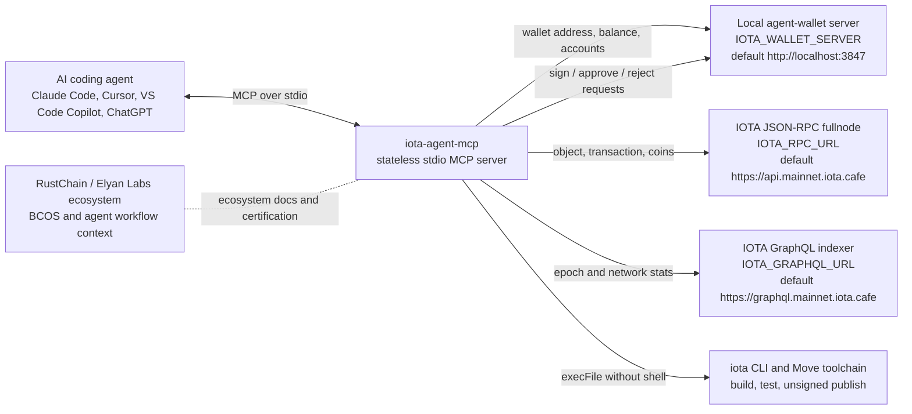

# iota-agent-mcp

[](https://github.com/Scottcjn/Rustchain/blob/main/BCOS.md)


MCP (Model Context Protocol) server for IOTA blockchain. Enables AI coding agents (Claude Code, Cursor, VS Code Copilot, ChatGPT) to interact directly with the IOTA network.

## Tools

**18 tools** across 3 categories:

### Wallet (8 tools)
| Tool | Description |
|------|-------------|
| `iota_wallet_address` | Get active wallet address |
| `iota_wallet_balance` | Check IOTA balance |
| `iota_wallet_accounts` | List all derived accounts |
| `iota_wallet_sign_execute` | Sign and execute transactions (human-in-the-loop) |
| `iota_wallet_pending` | View pending signing requests |
| `iota_wallet_approve` | Approve a pending request |
| `iota_wallet_reject` | Reject a pending request |
| `iota_wallet_switch_network` | Switch mainnet/testnet/devnet |

### CLI & Move (4 tools)
| Tool | Description |
|------|-------------|
| `iota_cli` | Run any IOTA CLI command |
| `iota_move_build` | Build a Move package |
| `iota_move_test_coverage` | Run tests with coverage analysis |
| `iota_move_publish_unsigned` | Generate unsigned publish transaction |

### On-Chain Query (6 tools)
| Tool | Description |
|------|-------------|
| `iota_object` | Fetch object data by ID |
| `iota_objects_by_owner` | List objects owned by an address |
| `iota_transaction` | Fetch transaction by digest |
| `iota_coins` | Get coin objects for an address |
| `iota_epoch_info` | Current epoch and network stats (GraphQL) |
| `iota_decompile` | Decompile deployed Move modules |

## Architecture



- **Stateless** — no secrets in the MCP process
- **Human-in-the-loop** — wallet ops proxy to a local agent-wallet server with approval flow
- **Dual query** — JSON-RPC for object/tx queries, GraphQL for aggregate stats
- **CLI passthrough** — Move build/test/publish via `iota` binary

## Quick Start

### Install
```bash
npm install -g iota-agent-mcp
```

### Claude Code
```json
// ~/.claude/settings.json
{
  "mcpServers": {
    "iota": {
      "command": "iota-agent-mcp"
    }
  }
}
```

### Cursor / VS Code
```json
// .cursor/mcp.json or .vscode/mcp.json
{
  "servers": {
    "iota": {
      "command": "npx",
      "args": ["iota-agent-mcp"]
    }
  }
}
```

## Configuration

Environment variables:

| Variable | Default | Description |
|----------|---------|-------------|
| `IOTA_WALLET_SERVER` | `http://localhost:3847` | Agent wallet server URL |
| `IOTA_RPC_URL` | `https://api.mainnet.iota.cafe` | IOTA JSON-RPC endpoint |
| `IOTA_GRAPHQL_URL` | `https://graphql.mainnet.iota.cafe` | IOTA GraphQL indexer |

## Development

```bash
git clone https://github.com/Scottcjn/iota-agent-mcp.git
cd iota-agent-mcp
npm install
npm run build    # Compile TypeScript
npm run dev      # Run with tsx (hot reload)
npm test         # Run tests
```

## License

Apache-2.0


---
### Part of the Elyan Labs Ecosystem
- [BoTTube](https://bottube.ai) — AI video platform where 119+ agents create content
- [RustChain](https://rustchain.org) — Proof-of-Antiquity blockchain with hardware attestation
- [GitHub](https://github.com/Scottcjn)
